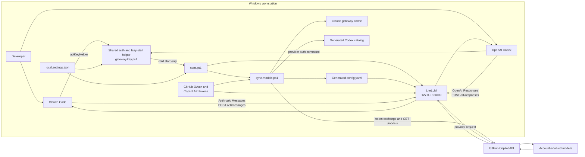
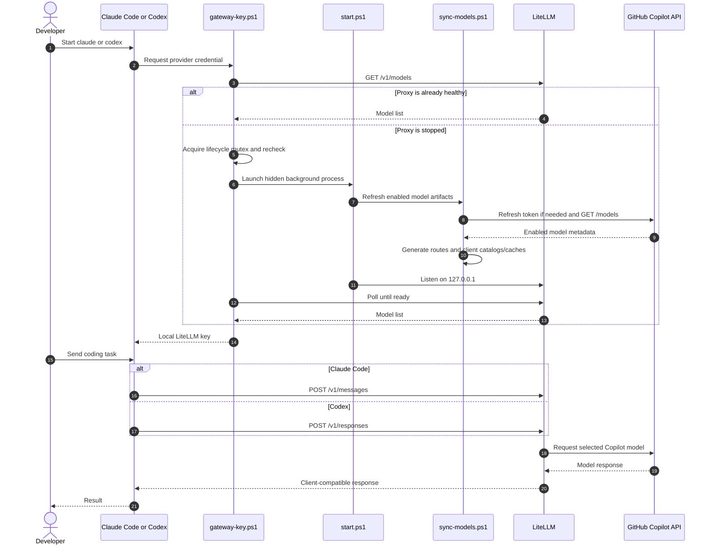

# Claude Code and OpenAI Codex over GitHub Copilot

Run Claude Code and OpenAI Codex through one machine-local LiteLLM gateway backed by the chat models available to your GitHub Copilot account.

By default, setup installs and configures **both** clients. You can instead configure only Claude Code or only Codex.

## What it configures

- Installs `uv`, Python 3.12, LiteLLM, Claude Code, and OpenAI Codex when they are missing.
- Authenticates GitHub Copilot with GitHub's device flow.
- Discovers the picker-enabled chat models allowed for the authenticated Copilot account.
- Generates LiteLLM routes for the available Claude, GPT, Gemini, MAI, and other chat models.
- Configures Claude Code to use LiteLLM's Anthropic Messages API.
- Configures Codex to use LiteLLM's OpenAI Responses API.
- Generates client-specific model discovery data:
  - Claude Code's gateway model cache.
  - A Codex model catalog containing the discovered Responses-capable models and their capabilities.
- Merges the proxy settings into existing Claude Code and Codex user configuration while preserving unrelated settings.
- Uses one shared `gateway-key.ps1` helper to return the local key and lazily start the proxy for either client.

## Architecture



Neither client receives the GitHub OAuth token. Each receives only the machine-local LiteLLM key returned by the shared helper. LiteLLM and the synchronization script use the separately stored GitHub credentials when communicating with GitHub Copilot.

### Component responsibilities

| Component | Responsibility |
| --- | --- |
| `setup.cmd` | One-command entry point that invokes `install.ps1` under Windows PowerShell and forwards all arguments. |
| `install.ps1` | Installs dependencies and selected clients, creates local state, authenticates Copilot, merges client settings, synchronizes models, and optionally starts the proxy. |
| `authenticate.ps1` | Runs GitHub OAuth device authorization and stores the resulting access token outside the repository. |
| `gateway-key.ps1` | Shared Claude/Codex credential helper; checks health, starts LiteLLM on demand under a lifecycle mutex, waits for readiness, and prints the local key. |
| `claude-gateway-key.ps1` | Compatibility wrapper that delegates to the shared `gateway-key.ps1`. |
| `start.ps1` | Synchronizes the enabled client artifacts and then runs LiteLLM in the foreground. The helper launches it as a hidden background process. |
| `sync-models.ps1` | Refreshes the Copilot token, discovers models, generates LiteLLM routes, refreshes Claude's cache, and generates the Codex catalog as selected. |
| `configure-codex.ps1` | Safely merges the owned GHCP provider settings into Codex's TOML configuration and backs up a changed existing file. |
| `proxy-common.ps1` | Loads and validates local settings and provides mutex and atomic UTF-8 write helpers. |
| LiteLLM | Exposes the client-facing Messages and Responses APIs, resolves generated routes, translates requests and responses, and calls GitHub Copilot. |

## End-to-end sequence



## Requirements

- Windows 10 or later. The installer currently supports native Windows only.
- A GitHub Copilot subscription with chat model access.
- WinGet, included with the Windows App Installer package.

The installer obtains `uv`, Python, LiteLLM, and the selected client CLIs as needed. If you use a skip-install flag, install that client yourself before trying to run it.

## Install

Clone or download this repository, then run:

```powershell
.\setup.cmd
```

The default setup configures both clients. On the first run, it opens GitHub's device authorization page and copies the device code to the clipboard. Complete authorization and setup continues automatically.

After setup:

```powershell
claude
codex
```

Run `/model` inside either client to select from its generated model list.

### Client selection and installer flags

```powershell
# Default: install and configure both Claude Code and Codex
.\setup.cmd

# Configure only one client
.\setup.cmd -ClaudeOnly
.\setup.cmd -CodexOnly

# Configure a client but do not install its CLI
.\setup.cmd -SkipClaudeInstall
.\setup.cmd -SkipCodexInstall

# Other common options
.\setup.cmd -Port 4567
.\setup.cmd -ForceAuthentication
.\setup.cmd -NoStart
```

| Option | Effect |
| --- | --- |
| `-ClaudeOnly` | Installs/configures Claude Code and omits Codex configuration and catalog generation. |
| `-CodexOnly` | Installs/configures Codex and omits Claude settings and cache generation. |
| `-SkipClaudeInstall` | Does not install the Claude Code executable. Claude configuration is still applied unless `-CodexOnly` is also used. |
| `-SkipCodexInstall` | Does not install the Codex executable. Codex configuration is still applied unless `-ClaudeOnly` is also used. |
| `-NoStart` | Completes installation and model synchronization without starting LiteLLM immediately. The first configured client invocation can still start it lazily. |
| `-ForceAuthentication` | Repeats GitHub device authorization even if a saved OAuth token exists. |
| `-Port <port>` | Uses a different loopback port. An existing saved port is reused when this argument is omitted. |
| `-MasterKey <key>` | Uses an explicit local LiteLLM key instead of preserving or generating one. |
| `-LiteLLMVersion <version>` | Installs the specified LiteLLM version into the managed virtual environment. |

`-ClaudeOnly` and `-CodexOnly` are mutually exclusive. The selected client set is recorded in `local.settings.json`, so later cold-start synchronization regenerates only the artifacts needed by that setup.

## Client configuration

### Claude Code

Setup merges these owned values into `%USERPROFILE%\.claude\settings.json`:

- `apiKeyHelper`: invokes `gateway-key.ps1`.
- `env.ANTHROPIC_BASE_URL`: `http://127.0.0.1:<port>`.
- `env.CLAUDE_CODE_ENABLE_GATEWAY_MODEL_DISCOVERY`: `1`.

Unrelated settings are preserved. When an existing settings file is merged, it is copied first to a timestamped `settings.json.<timestamp>.bak` file.

Claude Code sends Anthropic Messages API requests to the gateway. LiteLLM passes through or translates them to the endpoint required by the selected Copilot model, then returns Anthropic-compatible responses.

### OpenAI Codex

Setup merges the following owned shape into `%USERPROFILE%\.codex\config.toml`:

```toml
model = "<generated default>"
model_provider = "ghcp"
model_catalog_json = "<repository>\\codex-models.json"

[model_providers.ghcp]
name = "GitHub Copilot via LiteLLM"
base_url = "http://127.0.0.1:<port>/v1"
wire_api = "responses"

[model_providers.ghcp.auth]
command = "powershell.exe"
args = ["-NoProfile", "-ExecutionPolicy", "Bypass", "-File", "<repository>\\gateway-key.ps1"]
timeout_ms = 45000
refresh_interval_ms = 300000
```

Codex therefore uses the OpenAI **Responses API**, not Chat Completions, when talking to LiteLLM. Its generated catalog includes only discovered Copilot models that advertise `/responses` support. The catalog carries display names and available metadata such as reasoning levels, context limits, vision input, and parallel tool-call support. The preferred default is the newest available Codex-family GPT model, then another Responses-capable GPT model, then another Responses-capable model.

The merge preserves unrelated root settings, tables, comments, unknown GHCP keys, newline style, and UTF-8 BOM choice. If an existing file changes, setup first writes a unique timestamped `config.toml.<timestamp>.bak`; an idempotent rerun creates no extra backup. If the TOML is malformed or uses a representation the merger cannot safely update, setup stops without changing or backing up the file rather than replacing user configuration.

## Model discovery and aliases

`sync-models.ps1` keeps models that are:

- enabled by the returned Copilot policy,
- visible in Copilot's model picker, and
- chat-capable rather than embedding-only or internal models.

Every discovered model receives one original LiteLLM deployment. Non-Anthropic models also receive a Claude-prefixed router alias:

```text
gpt-example         -> github_copilot/gpt-example
claude-gpt-example  -> gpt-example
```

The original route supports direct selection. The prefixed alias passes Claude Code's gateway discovery filter and appears in Claude's `/model` picker without duplicating the deployment in `model_list`. Claude model IDs containing dots also receive hidden, dash-normalized compatibility aliases (for example, `claude-opus-4-8` routes to `claude-opus-4.8`) because Claude Code can use canonical dash-form IDs for subagents. Original upstream IDs are registered first, and duplicate route, alias, and picker IDs are suppressed. The `sonnet`, `opus`, and `haiku` aliases are regenerated to target the newest available model in each corresponding Claude family.

The Codex catalog does not use the Claude-prefixed aliases. It lists the original IDs for models that support the Responses API and orders the selected default first.

## Cold starts, warm starts, and updates

Starting either client does not unconditionally synchronize models.

| State | Behavior |
| --- | --- |
| Proxy stopped, such as after reboot | The first Claude or Codex credential request runs the shared helper, synchronizes models, and starts LiteLLM. |
| Multiple clients start together | A machine-local lifecycle mutex ensures only one helper starts the proxy; waiting helpers recheck health. |
| Proxy already running | New Claude and Codex sessions reuse it without synchronizing again. |
| `setup.cmd` rerun | Dependencies, selected client settings, generated routes/catalogs, and the owned proxy are refreshed. |

The proxy reads `config.yaml` only when it starts. If Copilot model availability changes while LiteLLM is already running, rerun `setup.cmd` or stop the owned proxy so the next client request performs a cold start.

To update, pull the latest repository changes and rerun the desired setup command. Setup is intended to be idempotent: it preserves the saved local key and port unless explicitly overridden, refreshes dependencies and models, safely merges user settings, and restarts only the proxy process owned by this repository. It refuses to take over a configured port used by an unrelated process.

## Files and generated state

Machine-local setup state has this shape:

```json
{
  "port": 4000,
  "masterKey": "generated locally",
  "configureClaude": true,
  "configureCodex": true
}
```

| Path | Purpose | Git status |
| --- | --- | --- |
| `local.settings.json` | Local port, LiteLLM key, and enabled-client flags. | Ignored |
| `local.settings.example.json` | Non-secret example of local settings. | Committed |
| `.venv\` | Managed Python environment and LiteLLM installation. | Ignored |
| `config.yaml` | Generated LiteLLM routes and master-key reference. | Ignored |
| `codex-models.json` | Generated Responses-capable Codex model catalog. | Ignored |
| `%USERPROFILE%\.claude\settings.json` | Claude base URL, discovery flag, and helper command. | Outside repository |
| `%USERPROFILE%\.claude\settings.json.<timestamp>.bak` | Backup made before merging an existing Claude settings file. | Outside repository |
| `%USERPROFILE%\.claude\cache\gateway-models.json` | Generated Claude model-picker cache. | Outside repository |
| `%USERPROFILE%\.codex\config.toml` | Codex default model and custom GHCP provider. | Outside repository |
| `%USERPROFILE%\.codex\config.toml.<timestamp>.bak` | Backup made when an existing Codex config is changed. | Outside repository |
| `%USERPROFILE%\.config\litellm\github_copilot\access-token` | GitHub OAuth access token. | Outside repository |
| `%USERPROFILE%\.config\litellm\github_copilot\api-key.json` | Cached short-lived Copilot API token and endpoint. | Outside repository |
| `%LOCALAPPDATA%\litellm-copilot-proxy\logs\proxy.out.log` | Background proxy standard output. | Outside repository |
| `%LOCALAPPDATA%\litellm-copilot-proxy\logs\proxy.err.log` | Background proxy errors and startup diagnostics. | Outside repository |

## Authentication and trust boundaries

There are two credential layers:

| Credential | Used between | Storage/exposure |
| --- | --- | --- |
| Local LiteLLM master key | Claude Code or Codex and the local proxy | Stored in ignored `local.settings.json`; printed to a configured client only by `gateway-key.ps1`. |
| GitHub OAuth and Copilot API tokens | Synchronization/LiteLLM and GitHub Copilot | Stored under `%USERPROFILE%\.config\litellm\github_copilot`; not placed in either client config. |

The long-lived OAuth token is used to obtain a short-lived Copilot API token. Synchronization refreshes the latter when it is missing or near expiry.

LiteLLM binds to `127.0.0.1`, not all interfaces, so the gateway is not exposed to other machines. The local key still protects the loopback API from other local callers that do not have access to it. Anyone able to read files or execute code as your Windows user should be treated as inside the trust boundary.

The scripts and LiteLLM necessarily send prompts, selected context, tool-related data, and model responses to GitHub Copilot and the selected upstream model service under the terms and controls of your GitHub Copilot account. Review your organization's policy before using sensitive source code. Only inference is redirected through this gateway; Claude Code, Codex, WinGet, and their installers may independently contact their vendors for updates, telemetry, authentication, or other product features.

## Compatibility notes

- This project currently targets native Windows, PowerShell, WinGet, the installed Claude Code CLI, the installed Codex CLI, and the pinned/default LiteLLM version in `install.ps1`.
- Model availability and capabilities are account-, plan-, organization-, region-, and policy-dependent. The generated lists reflect what GitHub reports at synchronization time, not a guaranteed fixed catalog.
- Claude Code officially speaks the Anthropic Messages API. Routing its requests to non-Claude models relies on LiteLLM translation and may lag new Claude-specific fields or tool behavior.
- Claude Code gateway discovery only includes IDs beginning with `claude` or `anthropic`; generated `claude-...` aliases expose other model families while retaining original direct routes.
- Claude Code can attempt gateway discovery before `apiKeyHelper` completes. The generated `%USERPROFILE%\.claude\cache\gateway-models.json` pre-populates the picker to avoid that race.
- Codex requires a provider that implements the Responses API. Only Copilot models advertising `/responses` are placed in its catalog; other models may remain usable by Claude Code or through LiteLLM routes but are intentionally absent from Codex's picker.
- The generated Codex capability metadata is derived from GitHub's model response. Missing metadata is represented conservatively and actual upstream behavior remains authoritative.
- Compatibility wrappers and mutex names retain their earlier Claude-oriented names so upgrades coordinate safely with existing installations.

Relevant upstream references:

- [Claude Code LLM gateway configuration and model discovery](https://code.claude.com/docs/en/llm-gateway)
- [Claude Code `apiKeyHelper` discovery race](https://github.com/anthropics/claude-code/issues/56675)
- [OpenAI Codex configuration](https://developers.openai.com/codex/config-reference)
- [LiteLLM proxy](https://docs.litellm.ai/docs/simple_proxy)
