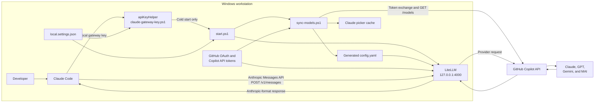
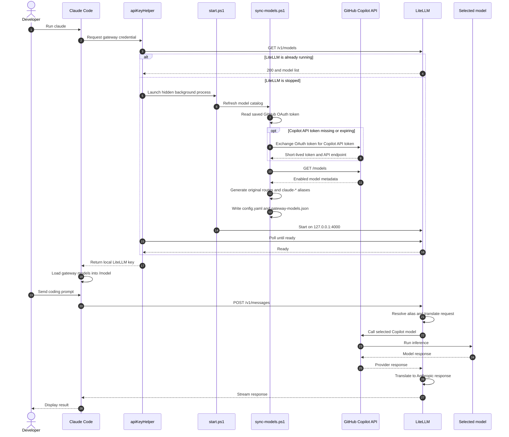

# Claude Code over GitHub Copilot

Run Claude Code through a local LiteLLM gateway backed by your GitHub Copilot subscription.

## What it configures

- Installs `uv`, Python 3.12, LiteLLM, and Claude Code when missing.
- Authenticates GitHub Copilot with GitHub's device flow.
- Discovers the chat models enabled for your Copilot account.
- Exposes Claude, GPT, Gemini, and MAI models through LiteLLM.
- Adds `claude-` aliases for non-Anthropic models so Claude Code includes them in `/model`.
- Pre-populates Claude Code's gateway model cache to work around the `apiKeyHelper` discovery race.
- Starts LiteLLM on demand when Claude Code requests its gateway key.
- Preserves unrelated values in your existing Claude Code user settings.

## Architecture



Claude Code never receives the GitHub OAuth token. It only receives a machine-local LiteLLM key. LiteLLM uses the separately stored GitHub credentials when communicating with GitHub Copilot.

### Component responsibilities

| Component | Responsibility |
| --- | --- |
| `setup.cmd` | One-command entry point that invokes `install.ps1` under Windows PowerShell. |
| `install.ps1` | Installs dependencies, creates local state, authenticates Copilot, merges Claude settings, synchronizes models, and starts the proxy. |
| `authenticate.ps1` | Runs GitHub OAuth device authorization and stores the resulting access token outside the repository. |
| `claude-gateway-key.ps1` | Implements Claude Code's `apiKeyHelper`, checks proxy health, starts the proxy on demand, and returns the local key. |
| `start.ps1` | Performs a model synchronization and then runs LiteLLM in the foreground. |
| `sync-models.ps1` | Refreshes the Copilot token, discovers models, generates routes and aliases, and refreshes Claude's picker cache. |
| `proxy-common.ps1` | Loads and validates local settings and provides atomic UTF-8 file writes. |
| LiteLLM | Accepts Anthropic Messages API requests, selects the configured route, translates formats when needed, and calls GitHub Copilot. |

## End-to-end sequence



## Cold start versus warm start

Starting Claude Code does not unconditionally synchronize models.

| State | Behavior |
| --- | --- |
| Proxy stopped, such as after reboot | The first Claude Code launch invokes the helper, runs a model sync, and starts LiteLLM. |
| Proxy already running | New Claude Code sessions reuse it without synchronizing again. |
| `setup.cmd` rerun | Dependencies, settings, models, cache, and the owned proxy are refreshed. |

The proxy loads `config.yaml` only when it starts. If model availability changes while it is already running, restart the proxy or rerun `setup.cmd`.

## Model discovery and aliases

GitHub Copilot returns the models enabled for the authenticated account. The sync script keeps entries that are:

- Enabled in the Copilot policy.
- Visible in Copilot's model picker.
- Chat-capable rather than embedding-only or internal models.

Each model receives its original LiteLLM route. Non-Anthropic models also receive a Claude-prefixed route:

```text
gpt-5.6-sol         -> github_copilot/gpt-5.6-sol
claude-gpt-5.6-sol  -> github_copilot/gpt-5.6-sol
```

The original route supports direct selection such as `claude --model gpt-5.6-sol`. The prefixed route passes Claude Code's gateway discovery filter and appears in `/model`.

The `sonnet`, `opus`, and `haiku` aliases are regenerated to point at the newest available model in each family whenever synchronization runs.

## Authentication and trust boundaries

There are two separate credentials:

| Credential | Used between | Storage |
| --- | --- | --- |
| Local LiteLLM master key | Claude Code and the loopback LiteLLM proxy | `local.settings.json` |
| GitHub OAuth and Copilot API tokens | The sync/runtime integration and GitHub Copilot | `%USERPROFILE%\.config\litellm\github_copilot` |

The LiteLLM server binds only to `127.0.0.1`, so it is not exposed to other machines. Credentials, generated configuration, and the virtual environment are excluded from Git.

The OAuth access token is relatively long-lived. The Copilot API token is short-lived and automatically refreshed from the OAuth token when synchronization runs.

## Requirements

- Windows 10 or later.
- A GitHub Copilot subscription with chat model access.
- WinGet. It is included with the Windows App Installer package.

## Install

Clone or download this repository, then run:

```powershell
.\setup.cmd
```

The installer opens GitHub's device authorization page on the first run. Complete that authorization, then the remaining setup continues automatically.

After setup:

```powershell
claude
```

Inside Claude Code, run:

```text
/model
```

## Update

Pull the latest repository changes and rerun:

```powershell
.\setup.cmd
```

The installer is idempotent. It preserves the generated local key and port, refreshes dependencies and models, updates Claude settings, and restarts the owned proxy.

## Configuration and generated state

Machine-local configuration is generated in `local.settings.json`:

```json
{
  "port": 4000,
  "masterKey": "generated locally"
}
```

| Path | Purpose | Committed |
| --- | --- | --- |
| `local.settings.json` | Local port and LiteLLM master key. | No |
| `.venv\` | Managed Python and LiteLLM installation. | No |
| `config.yaml` | Generated LiteLLM model routes. | No |
| `%USERPROFILE%\.claude\settings.json` | Claude base URL, discovery flag, and helper command. | Outside repository |
| `%USERPROFILE%\.claude\cache\gateway-models.json` | Model picker entries. | Outside repository |
| `%USERPROFILE%\.config\litellm\github_copilot` | GitHub OAuth and Copilot tokens. | Outside repository |
| `%LOCALAPPDATA%\litellm-copilot-proxy\logs` | Background proxy output and errors. | Outside repository |

Installer options:

```powershell
.\setup.cmd -Port 4000
.\setup.cmd -ForceAuthentication
.\setup.cmd -SkipClaudeInstall
.\setup.cmd -NoStart
```

## Request translation

Claude Code always sends an Anthropic Messages API request to the local gateway.

- Claude models can use GitHub Copilot's Anthropic-compatible message endpoint.
- GPT, Gemini, and MAI requests are translated by LiteLLM into the endpoint and schema expected by that model.
- LiteLLM converts the provider response back into Anthropic format before returning it to Claude Code.

Only model inference is redirected through LiteLLM. Claude Code may still make non-inference requests for updates, telemetry, or other product features.

## Compatibility notes

Routing Claude Code to non-Claude models is technically supported by LiteLLM but is not an Anthropic-supported Claude Code scenario. Claude-specific request fields or new Claude Code features may require updated LiteLLM translation support.

Claude Code only discovers gateway model IDs beginning with `claude` or `anthropic`. This repository gives non-Anthropic models router aliases such as `claude-gpt-5.6-sol` while retaining one original deployment per upstream model. Claude models containing dots also receive hidden, dash-normalized compatibility aliases such as `claude-opus-4-8` for subagents. Original model IDs are registered first, and duplicate deployment, alias, and picker IDs are suppressed.

Claude Code also has an open issue where gateway discovery can run before `apiKeyHelper` finishes. The sync script writes `%USERPROFILE%\.claude\cache\gateway-models.json` directly so the picker remains populated.

- [Claude Code gateway model discovery](https://code.claude.com/docs/en/llm-gateway-protocol#model-discovery)
- [apiKeyHelper discovery race](https://github.com/anthropics/claude-code/issues/56675)
